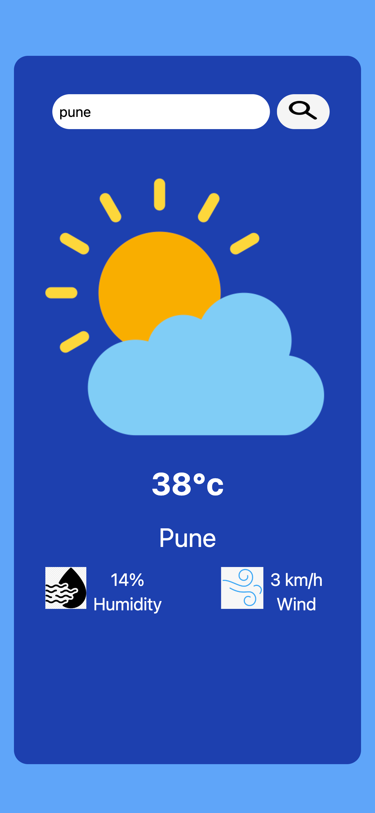

# Weather app

# With [ Weather App]

(https://turinix-weather-app.netlify.app/)

user can search locations by city name and observe the weather

# installation

- Created App using React js and Tailwind css
- Make sure you already have `Node.js` and `npm` installed in your system.
- You need an API key from [OpenWeatherMap](https://openweathermap.org/).

# Used libraries

- `react-js`
- `tailwind css`
- `axios`

Check `packages.json` for details

thank you😀
